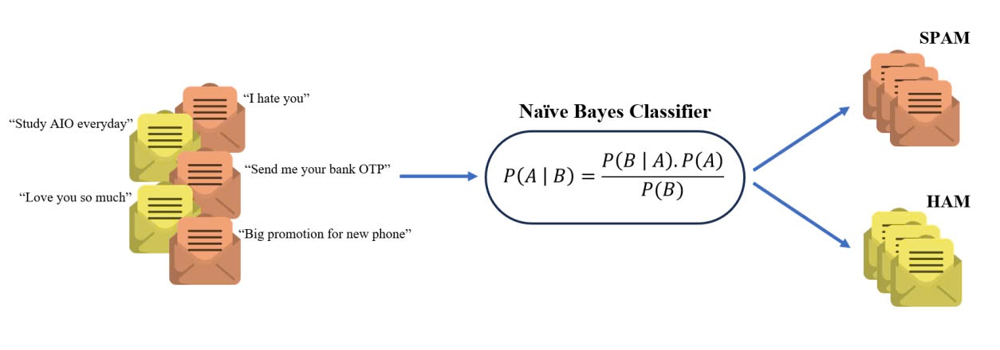

# Text-Classification
The project about Text Classification using Navie Bayer

<div style="display: flex; justify-content: center; align-items: center;">
   <div style="text-align: center; margin: 10px;">
    
    <p>Left Image</p>
  </div>
</div>

# How to run 
* Clone this repository 
```bash
git clone https://github.com/VayneMai020301/Text-Classification.git
```
* Environment Configuration
```bash
pip install nltk
pip install scikit-learn
pip install json
pip install joblib
pip install pandas
```
# Training 
```python
python main.py
```
# Evaluation 
```python
python evaluation.py
```
# Inference
```python
python inference.py
```
